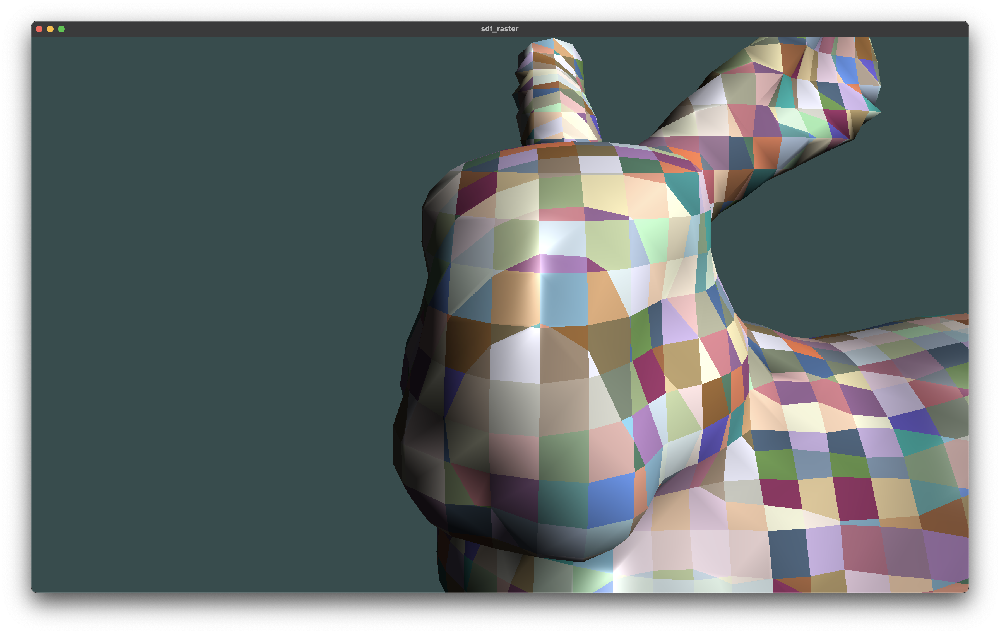
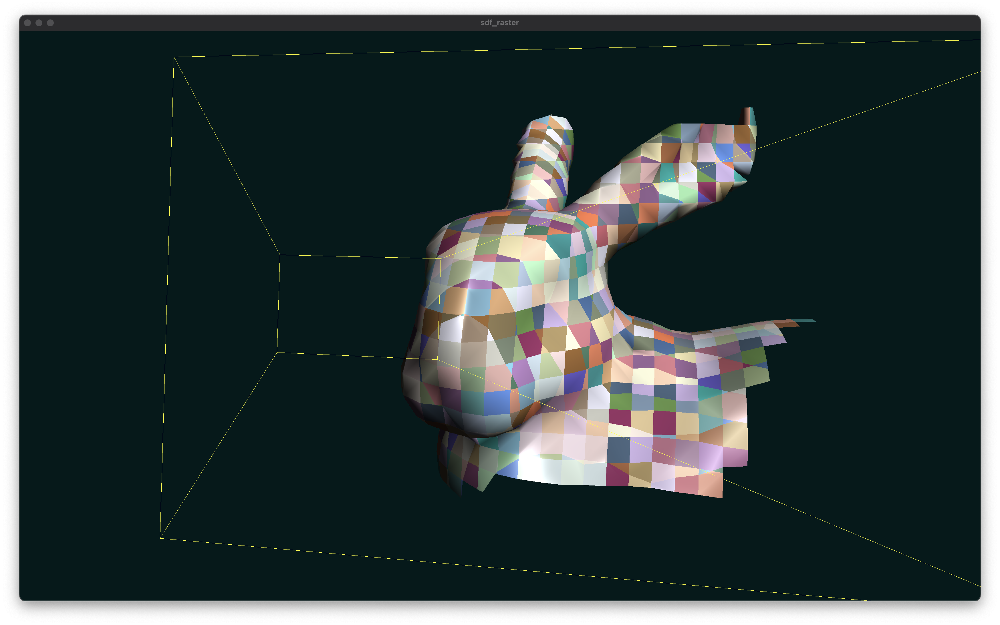

# sdf_raster

<p align="center">
  
  <br>
  <em>What camera sees.</em>
</p>

<p align="center">
  
  <br>
  <em>What is actually rendered.</em>
</p>

## About The Project

sdf_raster is a research renderer developed in C++ using the Vulkan API, designed for efficient rendering of SDF data in real-time. It showcases occlusion optimizations and mesh shaders (WIP).

The goal of this **master degree diploma** project is to develop accelerated implicit surface rasterization algorithm on GPU.

## Features

*   **SDF triangulation:** Dynamic geometry generation from SDF octrees using Marching Cubes.
*   **Frutum culling:** Culling whole SDF-octree subtrees which are not intersected with frustum.
*   **Fly-around cam:** Simple camera and controls for scene navigation. Caches previous camera view.
*   **Culling demo:** Ability to leave your current frustum and look at the renderered scene from another angle.
*   **Occlusion culling (WIP):** Occlusion culling optimization using H-Zbuffer.
*   **Mesh shading (WIP):** Directly feeding rasterizer with geometry, rather then using per-frame vertex buffers.

## Technology Stack

*   **Language:** `C++17` (or higher)
*   **Graphics API:** `Vulkan`
*   **Build System:** `CMake`
*   **Windowing System:** `GLFW`
*   **Third-party Libraries:**
    *   `Vulkan SDK` (for Vulkan API and tooling)
    *   `volk` (Vulkan function loader)
    *   `spdlog` (for logging)
    *   `LiteMath` (linear algebra)
    *   `nlohmann/json` (for configuration/data parsing)
    *   `dear ImGui` (for debug GUI/interface)
    *   `stb_image` (for texture/image loading, if used)
*   **Shader Language:** `Slang`

## Building the Project

### Prerequisites

*   **C++ Compiler:** g++-15
*   **CMake:** Version `3.16` or newer.
*   **Vulkan SDK:** Installed and properly configured. The `VULKAN_SDK` environment variable must be set. See script `utils/install_vulkan_sdk_apt.sh` for quick linux setup.

*   **OS:** Linux, macOS. **Windows is not supported.**

### Build Instructions

1.  **Clone the repository:**
    ```bash
    git clone https://github.com/Reefufui/sdf_raster.git
    cd sdf_raster
    ```

2.  **Configure and Build:**

    *   **For Linux:**
        ```bash
        cmake -B build -S . -DCMAKE_BUILD_TYPE=Release
        cmake --build build -j$(nproc)
        ```
        *Optionally, replace `-DCMAKE_BUILD_TYPE=Release` with `Debug` or `RelWithDebInfo`.*

    *   **For macOS:**
        ```bash
        # --- Using g++-15 (OpenMP support, sorry) ---
        cmake -B build -S . -DCMAKE_CXX_COMPILER=g++-15 -DCMAKE_BUILD_TYPE=Release
        cmake --build build -j$(nproc)

        ```
        *Optionally, replace `-DCMAKE_BUILD_TYPE=Release` with `Debug` or `RelWithDebInfo`.*

## Running the Project
**Important:** The application must be run from the `build` directory to ensure all resources are loaded correctly.

After building the project, navigate to the `build` directory and run the executable:

```bash
cd build
./bin/sdf_raster
```

## Usage and Controls

*   **Toggle Camera Mode:**
    *   `any mouse click | esc`: Exit flying camera mode. (Cursor becomes enabled).
    *   `right mouse click`: Enter flying camera mode. (Cursor becomes disabled).
*   **Movement (in Camera Mode):**
    *   `w, a, s, d`: Move forwards, left, backwards, right.
    *   `space`: Move up.
    *   `ctrl (control)`: Move down.
    *   `mouse movement`: Look around.
    *   `mouse scroll wheel`: Adjust FOV.
*   **Camera Reset:**
    *   `r`: Reset camera position and orientation.
*   **Toggle Frustum View:**
    *   `c`: Toggle culling visualization (to see which parts are rendered).
*   **Exit Application:**
    *   Close the window.

### Note

*   Camera settings are saved (`/tmp/cached_camera.json`) and restored between sessions.

