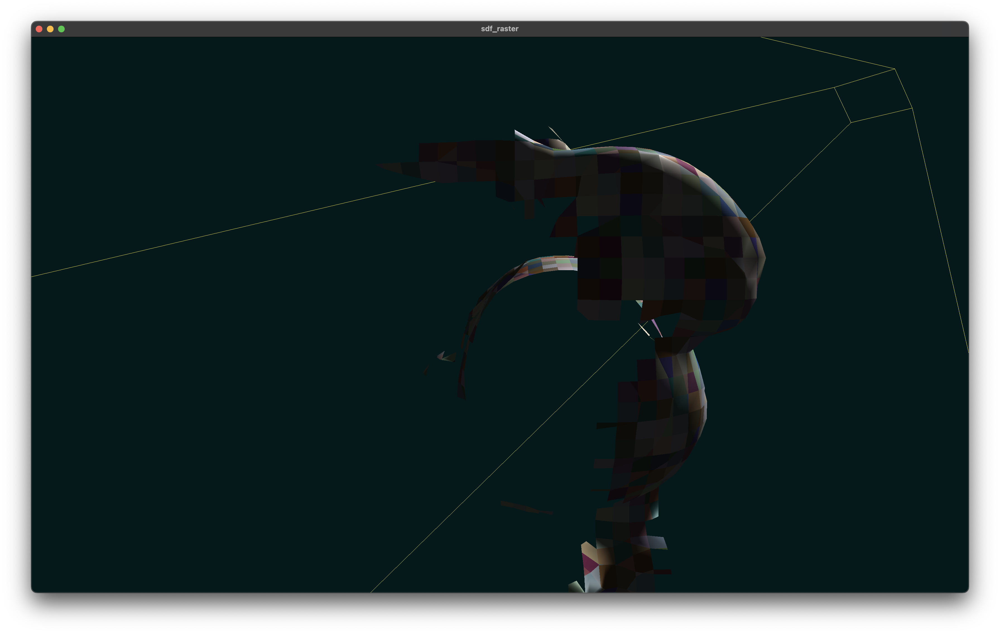

# sdf_raster

<p align="center">
  
  <br>
  <em>What camera sees.</em>
</p>

<p align="center">
  
  <br>
  <em>What is actually rendered.</em>
</p>

## About The Project

sdf_raster is a research renderer developed in C++ using the Vulkan API, designed for efficient rendering of SDF data in real-time. It showcases occlusion optimizations and mesh shaders.

The goal of this **master degree diploma** project is to develop accelerated implicit surface rasterization algorithm on GPU.

## Features

*   **SDF triangulation:** Dynamic geometry generation from SDF octrees using Marching Cubes.
*   **Frutum culling:** Culling whole SDF-octree subtrees which are not intersected with frustum.
*   **Fly-around cam:** Simple camera and controls for scene navigation.
*   **Culling demo:** Ability to leave your current frustum and look at the renderered scene from another angle.
*   **Occlusion culling:** Occlusion culling optimization using previous frame H-Zbuffer.
*   **Mesh shading:** Directly feeding rasterizer with geometry (if supported), rather then using per-frame vertex buffers.
*   **Application state caching:** Seemless restoration of previous launch state.

## Technology Stack

*   **Language:** `C++20, Slang`
*   **Graphics API:** `Vulkan 4.0+`
*   **Build System:** `CMake`
*   **Windowing System:** `GLFW`
*   **Third-party Libraries:**
    *   `volk` (for Vulkan function loading)
    *   `spdlog` (for logging)
    *   `LiteMath` (for linear algebra)
    *   `LiteImage` (for texture/image loading)
    *   `nlohmann/json` (for configuration/data parsing)
    *   `dear ImGui` (for GUI/interface)

## Building the Project

### Prerequisites

*   **OS:** Linux, macOS. **Windows is not supported.**
*   **CMake:** version `3.21` or newer.
*   **C++ Compiler:** any
*   **Git:** Required for cloning the repository with submodules.

#### Graphics Dependencies

You need to install development libraries for Vulkan and GLFW.

*   **GLFW:** A windowing system library.
    *   **On Debian/Ubuntu:**
        ```bash
        sudo apt install libglfw3-dev
        ```
    *   **On Arch Linux:**
        ```bash
        sudo pacman -S glfw
        ```
    *   **On Fedora:**
        ```bash
        sudo dnf install glfw-devel
        ```
    *   **On macOS (using Homebrew):**
        ```bash
        brew install glfw
        ```

*   **Vulkan:**
    You must have a Vulkan-compatible GPU and up-to-date drivers.

    **1. Minimum Requirements (for Release builds):**
    You need the Vulkan loader and development headers.

    *   **On Debian/Ubuntu:**
        ```bash
        sudo apt install libvulkan-dev vulkan-tools
        ```
    *   **On Arch Linux:**
        ```bash
        sudo pacman -S vulkan-icd-loader vulkan-headers
        ```
    *   **On Fedora:**
        ```bash
        sudo dnf install vulkan-loader-devel
        ```
    *   **On macOS (using Homebrew):**
        ```bash
        brew install vulkan-headers moltenvk
        ```
    _You can verify the installation by running `vulkaninfo`._

    **2. Full SDK (for Debug builds):**
    For debugging and access to validation layers, it is highly recommended to install the full Vulkan SDK.

    *   Download the SDK from the official website: **[vulkan.lunarg.com](https://vulkan.lunarg.com/)**.
    *   Follow their installation instructions and make sure the `VULKAN_SDK` environment variable is set correctly.
    *   For a quick setup on Debian/Ubuntu, you can use the provided script: `./utils/install_vulkan_sdk_apt.sh`.

#### Shading Language Compiler
*   **Slang Compiler:** The project uses `slangc` for shader compilation.
    *   You can use the provided helper script for a quick installation:
        ```bash
        ./utils/install_slang.sh
        ```


### Build Instructions

1.  **Clone the repository (with submodules):**
    ```bash
    git clone --recursive https://github.com/Reefufui/sdf_raster.git
    cd sdf_raster
    ```

2.  **Configure and Build:**
    You can use the provided helper scripts or build manually.

    *   **Using Scripts (Recommended):**
        *   For a Release build: `./utils/rebuild_release.sh`
        *   For a Debug build: `./utils/rebuild_debug.sh`

    *   **Manual Build:**
        *   **For Linux:**
            ```bash
            # For a Release build
            cmake -B build-release -S . -DCMAKE_BUILD_TYPE=Release
            cmake --build build-release -j$(nproc)

            # For a Debug build (Vulkan SDK is required)
            cmake -B build-debug -S . -DCMAKE_BUILD_TYPE=Debug
            cmake --build build-debug -j$(nproc)
            ```
        *   **For macOS:**
            ```bash
            # For a Release build
            cmake -B build-release -S . -DCMAKE_BUILD_TYPE=Release
            cmake --build build-release -j$(sysctl -n hw.ncpu)

            # For a Debug build (Vulkan SDK is required)
            cmake -B build-debug -S . -DCMAKE_BUILD_TYPE=Debug
            cmake --build build-debug -j$(sysctl -n hw.ncpu)
            ```

## Running the Project
**Important:** The application must be run from the build directory to ensure all resources are loaded correctly.

After building the project, navigate to the build directory and run the executable:

```bash
# If you built in release mode
cd build-release
./bin/sdf_raster

# Or if you built in debug mode
cd build-debug
./bin/sdf_raster
```

## Usage and Controls

*   **Toggle Camera Mode:**
    *   `click | esc`: Exit flying camera mode. (Cursor becomes enabled).
    *   `right click`: Enter flying camera mode. (Cursor becomes disabled).
*   **Movement (in Camera Mode):**
    *   `w, a, s, d`: Move forwards, left, backwards, right.
    *   `space`: Move up.
    *   `ctrl (control)`: Move down.
    *   `mouse`: Look around.
    *   `scroll`: Adjust FOV.
*   **Camera Reset:**
    *   `r`: Reset camera position and orientation.
*   **Toggle Frustum View:**
    *   `c`: Toggle culling visualization (to see which parts are rendered).
*   **Exit Application:**
    *   Close the window.

### Note

*   Application state is saved (`/tmp/sdf_raster.json`) and restored between sessions.

